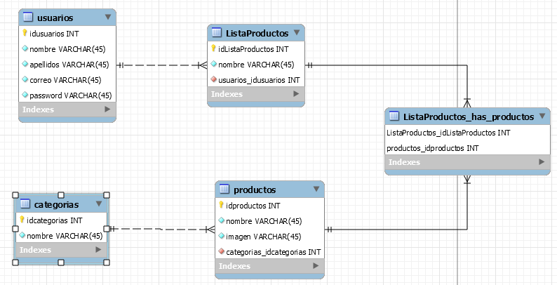

# Objetivo
    El objetivo de la Aplicación Móvil es que cada usuario tenga en el móvil una lista deproductos habituales del supermercado, donde pueda llevar un control de los productos necesarios a la hora de hacer la compra diaria o semanal para su hogar. Podrá agregar productos a una lista previamente creada, y de esa manera tener un mejor control a la hora de ir al supermercado.

# Pila Técnologica

### Backend:
    Usamos la base de datos MYSQL como persistencia para almacenar los datos de los usuarios, productos.

    estructura de la Base de Datos

En la carpeta de BACKEND, en la parte de Config

Configuraremos con nuestro datos de la base de datos MYSQL WORBENCH.

finalmente npm start.

### Front-end:

    hecho con React Native
    en la carpeta URL y el fichero cambias la url de tu maquina.
    finalmente npm start

